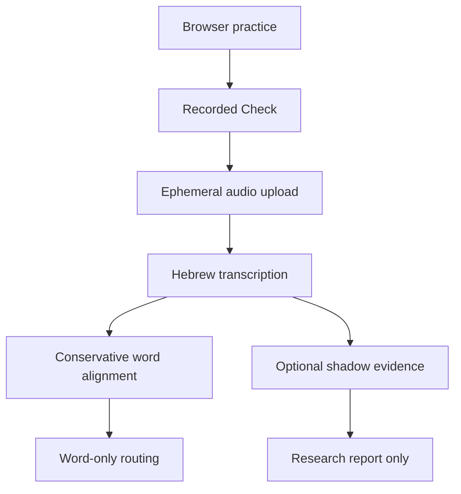

# Shemoneh Esrei Reading Coach

This branch turns the single-file prototype into a testable pilot. It keeps the
instant browser practice experience, adds a structured Hebrew transcription API,
and removes the unsupported claim that the software can grade nikud.

The current authoritative result is still a word-and-order reading pilot, not a
complete kriah assessor. An optional shadow layer now collects nikud-aware CTC
acoustic evidence without changing a score, pass, retry, or review decision.
Automatic pronunciation decisions remain blocked until that evidence passes the
evaluation gates.

## What is implemented

- `index.html`: static student and teacher interface
- `server/app.py`: FastAPI service with health, transcription, structured
  word-order analysis, and signed-result verification endpoints
- `server/scoring.py`: dependency-free Hebrew normalization and global word
  alignment with explicit missing, extra, different, and uncertain operations
- `server/transcriber.py`: lazy `faster-whisper` adapter using the ivrit.ai Hebrew
  model without an expected-text prompt
- `server/hebrew_g2p.py`: pointed-Hebrew pronunciation map with explicit mixed,
  Sephardi, and Ashkenazi alternatives
- `server/pronunciation.py`: optional, lazy CTC Viterbi evidence inside ASR word
  windows; permanently non-authoritative while configured as shadow mode
- `evaluation/metrics.py`: speaker-disjoint pilot metrics, including false-pass
  and false-flag rates
- `tests/`: unit, API, tamper-detection, evaluation, and browser-script checks

Teacher and student recordings are intentionally absent from this public branch.

## What it does not do

- It does not make pass/fail decisions about nikud.
- It does not establish that a child's pronunciation is correct.
- It does not provide a validated mastery score.
- It does not store recordings or provide a teacher dashboard.
- It does not authenticate students or teachers.

## Nikud shadow mode and selective review

The pointed text is now converted into expected sound slots. When shadow mode is
enabled, a separate multilingual phoneme model measures evidence for those slots
inside each ASR-located word window. The server returns the raw evidence marked
`uncalibrated`, while routing continues to use only word identity and order. See
[`NIKUD.md`](NIKUD.md) for the evidence contract and remaining limitations.

Whisper returns unvocalized Hebrew, so vowel-only differences remain outside the
word transcript. The shadow model is Meta's multilingual
[`wav2vec2-lv-60-espeak-cv-ft`](https://huggingface.co/facebook/wav2vec2-lv-60-espeak-cv-ft),
whose model card describes phoneme recognition but does not validate Hebrew
child liturgical assessment. Research reports weaker pronunciation-score
discrimination for child speech than adult speech, so the older one-speaker
comparison is not treated as a grade:
[Cao et al., Interspeech 2023](https://www.isca-archive.org/interspeech_2023/cao23_interspeech.pdf).

## Architecture



Native ASR word timestamps are not treated as forced alignment. If a later
phoneme scorer needs tight time boundaries, use and validate a dedicated
alignment system. [WhisperX](https://github.com/m-bain/whisperX) documents this
as a separate alignment stage.

## Free browser test with GitHub Codespaces

[](https://codespaces.new/dovlevinson/shemoneh-esrei/tree/codex/kriah-rebuild?quickstart=1)

The Codespaces configuration installs the pinned server dependencies, starts the
analysis service, and opens the application on its forwarded HTTPS address. The
first Recorded Check downloads and loads the speech model, so it can take much
longer than later attempts. Stop the codespace after testing so it no longer uses
included compute time.

This is a developer smoke test, not evidence that the model grades children or
nikud accurately. Use only consented adult test recordings until the privacy and
evaluation gates below are complete.

## Run locally

The server now hosts both the browser application and analysis API:

```bash
python -m venv .venv
. .venv/bin/activate
pip install -r server/requirements-dev.txt
uvicorn server.app:app --host 127.0.0.1 --port 8000
```

Open `http://127.0.0.1:8000` in Chrome. In Teacher, enable recorded-reading
analysis and use Test connection to confirm the server is available.

The first server request downloads and loads the speech model, so it will be
slower than later requests.

### Enable experimental pronunciation evidence

The normal Codespaces setup intentionally does not install the additional large
model stack. To run the research layer in cloud storage without changing the
student result:

```bash
pip install -r server/requirements-pronunciation.txt
KRIAH_PRONUNCIATION_MODE=shadow \
  uvicorn server.app:app --host 0.0.0.0 --port 8000
```

The API health response must show `shadow-pronunciation-evidence`. Every
pronunciation response also states `affects_routing: false`.

For a local JSON research report using a consented adult recording:

```bash
KRIAH_PRONUNCIATION_MODE=shadow \
  python -m research.pronunciation_report --bracha 4 /private/reading.webm
```

Do not place recordings or generated reports inside this public repository.

## Run checks

```bash
PYTHONPATH=. python -m unittest discover -s tests -v
node tests/check_html.mjs
python -m compileall -q server evaluation tests
```

## Before real students

Read these in order:

1. [`EVALUATION.md`](EVALUATION.md)
2. [`PRIVACY.md`](PRIVACY.md)
3. [`DEPLOYMENT.md`](DEPLOYMENT.md)
4. [`STATUS.md`](STATUS.md)

No software license has been selected for this repository. The prayer-text
source and its license must be verified separately before redistribution beyond
the intended school pilot.
