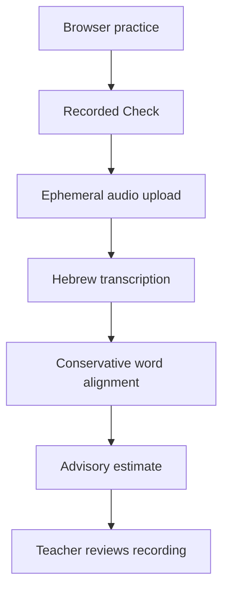

# Shemoneh Esrei Reading Coach

This branch turns the single-file prototype into a testable pilot. It keeps the
instant browser practice experience, adds a structured Hebrew transcription API,
and removes the unsupported claim that the software can grade nikud.

The current system is a reading aid, not an autonomous kriah assessor. A teacher
must make any instructional grade or mastery decision.

## What is implemented

- `index.html`: static student and teacher interface
- `server/app.py`: FastAPI service with health, transcription, structured
  word-order analysis, and signed-result verification endpoints
- `server/scoring.py`: dependency-free Hebrew normalization and global word
  alignment with explicit missing, extra, different, and uncertain operations
- `server/transcriber.py`: lazy `faster-whisper` adapter using the ivrit.ai Hebrew
  model without an expected-text prompt
- `evaluation/metrics.py`: speaker-disjoint pilot metrics, including false-pass
  and false-flag rates
- `tests/`: unit, API, tamper-detection, evaluation, and browser-script checks

Teacher and student recordings are intentionally absent from this public branch.

## What it does not do

- It does not grade nikud.
- It does not establish that a child's pronunciation is correct.
- It does not provide a validated mastery score.
- It does not store recordings or provide a teacher dashboard.
- It does not authenticate students or teachers.

Whisper returns unvocalized Hebrew, so vowel-only differences are outside the
available evidence. The selected [ivrit.ai model card](https://huggingface.co/ivrit-ai/whisper-large-v3-turbo-ct2)
also does not establish accuracy for child or liturgical speech. Research on
child pronunciation assessment reports wider child score distributions and
weaker GOP behavior than adult settings, which is why the older one-speaker
phoneme comparison is quarantined as research rather than shipped as a grade:
[Cao et al., Interspeech 2023](https://www.isca-archive.org/interspeech_2023/cao23_interspeech.pdf).

## Architecture



Native ASR word timestamps are not treated as forced alignment. If a later
phoneme scorer needs tight time boundaries, use and validate a dedicated
alignment system. [WhisperX](https://github.com/m-bain/whisperX) documents this
as a separate alignment stage.

## Run locally

Backend:

```bash
python -m venv .venv
. .venv/bin/activate
pip install -r server/requirements-dev.txt
uvicorn server.app:app --host 127.0.0.1 --port 8000
```

Frontend, in a second terminal:

```bash
python -m http.server 8080
```

Open `http://127.0.0.1:8080` in Chrome. In Teacher, enable recorded-reading
analysis and confirm the default endpoint is
`http://127.0.0.1:8000/analyze-reading`.

The first server request downloads and loads the speech model, so it will be
slower than later requests.

## Run checks

```bash
PYTHONPATH=. python -m unittest discover -s tests -v
node tests/check_html.mjs
python -m compileall -q server evaluation tests
```

## Before real students

Read these in order:

1. [`EVALUATION.md`](EVALUATION.md)
2. [`PRIVACY.md`](PRIVACY.md)
3. [`DEPLOYMENT.md`](DEPLOYMENT.md)
4. [`STATUS.md`](STATUS.md)

No software license has been selected for this repository. The prayer-text
source and its license must be verified separately before redistribution beyond
the intended school pilot.
